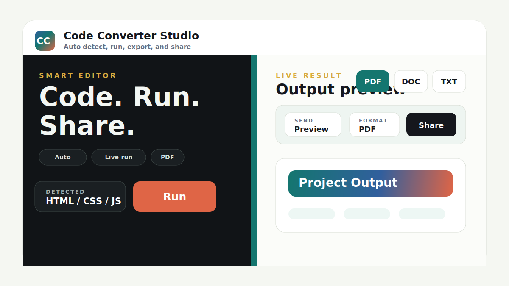

# Code Converter Studio

Code Converter Studio is a polished web workspace for writing code, auto-detecting the language, running or previewing the result, exporting output, and sharing selected content in common file formats.



## Highlights

- Auto-detects HTML, JavaScript, Python, Java, C, C++, and plain text.
- Runs HTML and JavaScript directly in the browser.
- Runs Python, Java, C, and C++ through the included local server when the matching runtime/compiler is installed.
- Exports all content, preview only, output only, code only, or output plus code.
- Supports PDF, DOC, XLS, CSV, and TXT export formats.
- Shares through the device share sheet, WhatsApp, clipboard, or download fallback.
- Includes a draggable desktop split view and a responsive mobile layout.
- Works as a static page, with enhanced runner features when started through Node.js.

## Live Workspace

Open `index.html` directly for browser-only mode.

For full local runner mode:

```powershell
npm start
```

Then open:

```text
http://127.0.0.1:5173
```

## Supported Languages

| Language | Browser mode | Local server mode |
| --- | --- | --- |
| HTML / CSS / JS | Live preview | Live preview |
| JavaScript | Console and preview | Console and preview |
| Python | Output inference fallback | Real execution with Python |
| Java | Output inference fallback | Real execution with JDK |
| C | Output inference fallback | Real execution with GCC |
| C++ | Output inference fallback | Real execution with G++ |
| Plain text | Preview | Preview |

## Export And Share

The share panel lets you choose exactly what to send:

- All
- Preview only
- Output only
- Code only
- Output + code

Then choose the file format:

- PDF
- DOC
- XLS
- CSV
- TXT

The app first tries direct sharing. If the browser does not support sharing that file type, it shares text content. If sharing is blocked completely, it downloads the file as a final fallback.

## Project Structure

```text
.
|-- index.html
|-- styles.css
|-- script.js
|-- server.js
|-- package.json
|-- README.md
|-- LICENSE
|-- CHANGELOG.md
|-- CONTRIBUTING.md
|-- CODE_OF_CONDUCT.md
|-- SECURITY.md
|-- docs/
|   `-- preview.svg
`-- .gitignore
```

## Requirements

Browser-only mode needs only a modern browser.

Full local runner mode needs:

- Node.js
- Python for Python execution
- JDK for Java execution
- GCC for C execution
- G++ for C++ execution

## Scripts

```powershell
npm start
```

Starts the local server on:

```text
http://127.0.0.1:5173
```

You can change the port:

```powershell
$env:PORT=3000; npm start
```

## Notes

This project is designed for local code experiments and educational use. The local runner executes code on your own machine, so only run code you trust.

## License

This project is licensed under the MIT License. See [LICENSE](LICENSE).
